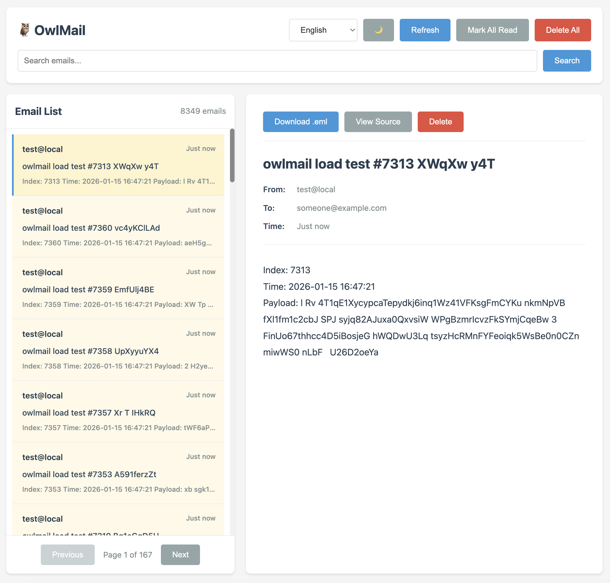

# OwlMail

> 🦉 Ein in Go implementiertes E-Mail-Entwicklungs- und Testtool, vollständig kompatibel mit MailDev, mit besserer Leistung und mehr Funktionen

[](https://golang.org/)
[](LICENSE)
[](https://github.com/maildev/maildev)
[](https://goreportcard.com/report/github.com/soulteary/owlmail)
[](https://codecov.io/gh/soulteary/owlmail)

## 🌍 Languages / 语言 / Sprachen / Langues / Lingue / 言語 / 언어

- [English](README.md) | [简体中文](README.zh-CN.md) | [Deutsch](README.de.md) | [Français](README.fr.md) | [Italiano](README.it.md) | [日本語](README.ja.md) | [한국어](README.ko.md)

---

OwlMail ist ein SMTP-Server und Web-Interface für Entwicklungs- und Testumgebungen, das alle gesendeten E-Mails erfasst und anzeigt. Es ist eine Go-Implementierung von [MailDev](https://github.com/maildev/maildev) mit 100% API-Kompatibilität und bietet gleichzeitig bessere Leistung, geringeren Ressourcenverbrauch und mehr Funktionen.


## 📸 Vorschau



## 🎥 Demo-Video

<video width="100%" controls>
  <source src=".github/assets/realtime.mp4" type="video/mp4">
  Ihr Browser unterstützt das Video-Tag nicht.
</video>

## ✨ Funktionen

### Kernfunktionen

- ✅ **SMTP-Server** - Empfängt und speichert alle gesendeten E-Mails (Standard-Port 1025)
- ✅ **Web-Interface** - E-Mails über einen Browser anzeigen und verwalten (Standard-Port 1080)
- ✅ **E-Mail-Persistenz** - E-Mails werden als `.eml`-Dateien gespeichert, unterstützt Laden aus Verzeichnis
- ✅ **E-Mail-Weiterleitung** - Unterstützt Weiterleitung von E-Mails an echte SMTP-Server
- ✅ **Auto-Relay** - Unterstützt automatische Weiterleitung aller E-Mails mit Regel-Filterung
- ✅ **SMTP-Authentifizierung** - Unterstützt PLAIN/LOGIN-Authentifizierung
- ✅ **TLS/STARTTLS** - Unterstützt verschlüsselte Verbindungen
- ✅ **SMTPS** - Unterstützt direkte TLS-Verbindung auf Port 465 (OwlMail exklusiv)

### Erweiterte Funktionen

- 🆕 **Batch-Operationen** - Batch-Löschen, Batch-als-gelesen-markieren
- 🆕 **E-Mail-Statistiken** - E-Mail-Statistiken abrufen
- 🆕 **E-Mail-Vorschau** - Leichtgewichtige E-Mail-Vorschau-API
- 🆕 **E-Mail-Export** - E-Mails als ZIP-Dateien exportieren
- 🆕 **Konfigurationsverwaltungs-API** - Vollständige Konfigurationsverwaltung (GET/PUT/PATCH)
- 🆕 **Leistungsstarke Suche** - Volltextsuche, Datumsbereichsfilterung, Sortierung
- 🆕 **Verbesserte RESTful API** - Standardisierteres API-Design (`/api/v1/*`)

### Kompatibilität

- ✅ **100% MailDev API-kompatibel** - Alle MailDev API-Endpunkte werden unterstützt
- ✅ **Umgebungsvariablen vollständig kompatibel** - Priorisiert MailDev-Umgebungsvariablen, keine Konfigurationsänderungen erforderlich
- ✅ **Auto-Relay-Regeln kompatibel** - JSON-Konfigurationsdateiformat vollständig kompatibel

### Leistungsvorteile

- ⚡ **Einzelne Binärdatei** - Als einzelne ausführbare Datei kompiliert, keine Laufzeit erforderlich
- ⚡ **Geringer Ressourcenverbrauch** - Go-kompiliert, geringerer Speicherverbrauch
- ⚡ **Schneller Start** - Schnellere Startzeit
- ⚡ **Hohe Parallelität** - Go-Goroutinen, bessere Parallelleistung

## 🚀 Schnellstart

### Installation

#### Aus Quellcode kompilieren

```bash
# Repository klonen
git clone https://github.com/soulteary/owlmail.git
cd owlmail

# Kompilieren
go build -o owlmail ./cmd/owlmail

# Ausführen
./owlmail
```

#### Mit Go installieren

```bash
go install github.com/soulteary/owlmail/cmd/owlmail@latest
owlmail
```

### Grundlegende Verwendung

```bash
# Mit Standardkonfiguration starten (SMTP: 1025, Web: 1080)
./owlmail

# Benutzerdefinierte Ports
./owlmail -smtp 1025 -web 1080

# Umgebungsvariablen verwenden
export MAILDEV_SMTP_PORT=1025
export MAILDEV_WEB_PORT=1080
./owlmail
```

### Docker-Verwendung

#### Von GitHub Container Registry abrufen (Empfohlen)

Der einfachste Weg, OwlMail zu verwenden, ist das Abrufen des vorgefertigten Images von GitHub Container Registry:

```bash
# Neuestes Image abrufen
docker pull ghcr.io/soulteary/owlmail:latest

# Bestimmte Version abrufen (mit Commit-SHA)
docker pull ghcr.io/soulteary/owlmail:sha-49b5f35

# Container ausführen
docker run -d \
  -p 1025:1025 \
  -p 1080:1080 \
  --name owlmail \
  ghcr.io/soulteary/owlmail:latest
```

**Verfügbare Tags:**
- `latest` - Neueste stabile Version
- `sha-<commit>` - Bestimmter Commit-SHA (z.B. `sha-49b5f35`)
- `main` - Neueste Version vom main-Branch

**Multi-Architektur-Unterstützung:**
Das Image unterstützt sowohl `linux/amd64` als auch `linux/arm64` Architekturen. Docker lädt automatisch das richtige Image für Ihre Plattform herunter.

**Alle verfügbaren Images anzeigen:** [GitHub Packages](https://github.com/users/soulteary/packages/container/package/owlmail)

#### Aus Quellcode erstellen

##### Grundlegender Build (Einzelarchitektur)

```bash
# Image für aktuelle Architektur erstellen
docker build -t owlmail .

# Container ausführen
docker run -d \
  -p 1025:1025 \
  -p 1080:1080 \
  --name owlmail \
  owlmail
```

##### Multi-Architektur-Build

Für aarch64 (ARM64) oder andere Architekturen verwenden Sie Docker Buildx:

```bash
# Buildx aktivieren (falls noch nicht aktiviert)
docker buildx create --use --name multiarch-builder

# Für mehrere Architekturen erstellen
docker buildx build \
  --platform linux/amd64,linux/arm64 \
  -t owlmail:latest \
  --load .

# Oder erstellen und in Registry pushen
docker buildx build \
  --platform linux/amd64,linux/arm64 \
  -t your-registry/owlmail:latest \
  --push .

# Für spezifische Architektur erstellen (z.B. aarch64/arm64)
docker buildx build \
  --platform linux/arm64 \
  -t owlmail:latest \
  --load .
```

**Hinweis**: Das Dockerfile unterstützt jetzt Multi-Architektur-Builds mit `TARGETOS`- und `TARGETARCH`-Build-Argumenten, die automatisch von Docker Buildx gesetzt werden.

## 📖 Konfigurationsoptionen

### Befehlszeilenargumente

| Argument | Umgebungsvariable | Standard | Beschreibung |
|----------|------------------|---------|--------------|
| `-smtp` | `MAILDEV_SMTP_PORT` / `OWLMAIL_SMTP_PORT` | 1025 | SMTP-Port |
| `-ip` | `MAILDEV_IP` / `OWLMAIL_SMTP_HOST` | localhost | SMTP-Host |
| `-web` | `MAILDEV_WEB_PORT` / `OWLMAIL_WEB_PORT` | 1080 | Web-API-Port |
| `-web-ip` | `MAILDEV_WEB_IP` / `OWLMAIL_WEB_HOST` | localhost | Web-API-Host |
| `-mail-directory` | `MAILDEV_MAIL_DIRECTORY` / `OWLMAIL_MAIL_DIR` | - | E-Mail-Speicherverzeichnis |
| `-web-user` | `MAILDEV_WEB_USER` / `OWLMAIL_WEB_USER` | - | HTTP Basic Auth Benutzername |
| `-web-password` | `MAILDEV_WEB_PASS` / `OWLMAIL_WEB_PASSWORD` | - | HTTP Basic Auth Passwort |
| `-https` | `MAILDEV_HTTPS` / `OWLMAIL_HTTPS_ENABLED` | false | HTTPS aktivieren |
| `-https-cert` | `MAILDEV_HTTPS_CERT` / `OWLMAIL_HTTPS_CERT` | - | HTTPS-Zertifikatsdatei |
| `-https-key` | `MAILDEV_HTTPS_KEY` / `OWLMAIL_HTTPS_KEY` | - | HTTPS-Private-Key-Datei |
| `-outgoing-host` | `MAILDEV_OUTGOING_HOST` / `OWLMAIL_OUTGOING_HOST` | - | Ausgehender SMTP-Host |
| `-outgoing-port` | `MAILDEV_OUTGOING_PORT` / `OWLMAIL_OUTGOING_PORT` | 587 | Ausgehender SMTP-Port |
| `-outgoing-user` | `MAILDEV_OUTGOING_USER` / `OWLMAIL_OUTGOING_USER` | - | Ausgehender SMTP-Benutzername |
| `-outgoing-pass` | `MAILDEV_OUTGOING_PASS` / `OWLMAIL_OUTGOING_PASSWORD` | - | Ausgehendes SMTP-Passwort |
| `-outgoing-secure` | `MAILDEV_OUTGOING_SECURE` / `OWLMAIL_OUTGOING_SECURE` | false | Ausgehendes SMTP TLS |
| `-auto-relay` | `MAILDEV_AUTO_RELAY` / `OWLMAIL_AUTO_RELAY` | false | Auto-Relay aktivieren |
| `-auto-relay-addr` | `MAILDEV_AUTO_RELAY_ADDR` / `OWLMAIL_AUTO_RELAY_ADDR` | - | Auto-Relay-Adresse |
| `-auto-relay-rules` | `MAILDEV_AUTO_RELAY_RULES` / `OWLMAIL_AUTO_RELAY_RULES` | - | Auto-Relay-Regeldatei |
| `-smtp-user` | `MAILDEV_INCOMING_USER` / `OWLMAIL_SMTP_USER` | - | SMTP-Authentifizierungsbenutzername |
| `-smtp-password` | `MAILDEV_INCOMING_PASS` / `OWLMAIL_SMTP_PASSWORD` | - | SMTP-Authentifizierungspasswort |
| `-tls` | `MAILDEV_INCOMING_SECURE` / `OWLMAIL_TLS_ENABLED` | false | SMTP TLS aktivieren |
| `-tls-cert` | `MAILDEV_INCOMING_CERT` / `OWLMAIL_TLS_CERT` | - | SMTP TLS-Zertifikatsdatei |
| `-tls-key` | `MAILDEV_INCOMING_KEY` / `OWLMAIL_TLS_KEY` | - | SMTP TLS-Private-Key-Datei |
| `-log-level` | `MAILDEV_VERBOSE` / `MAILDEV_SILENT` / `OWLMAIL_LOG_LEVEL` | normal | Protokollierungsstufe |
| `-use-uuid-for-email-id` | `OWLMAIL_USE_UUID_FOR_EMAIL_ID` | false | UUID für E-Mail-IDs verwenden (Standard: 8-Zeichen-Zufallszeichenfolge) |

### Umgebungsvariablen-Kompatibilität

OwlMail **unterstützt vollständig MailDev-Umgebungsvariablen**, priorisiert MailDev-Umgebungsvariablen und fällt auf OwlMail-Umgebungsvariablen zurück, wenn diese nicht vorhanden sind. Dies bedeutet, dass Sie die MailDev-Konfiguration direkt ohne Änderung verwenden können.

```bash
# MailDev-Umgebungsvariablen direkt verwenden (empfohlen)
export MAILDEV_SMTP_PORT=1025
export MAILDEV_WEB_PORT=1080
export MAILDEV_OUTGOING_HOST=smtp.gmail.com
./owlmail

# Oder OwlMail-Umgebungsvariablen verwenden
export OWLMAIL_SMTP_PORT=1025
export OWLMAIL_WEB_PORT=1080
./owlmail
```

## 📡 API-Dokumentation

### API-Antwortformat

OwlMail verwendet ein standardisiertes API-Antwortformat:

**Erfolgreiche Antwort:**
```json
{
  "code": "EMAIL_DELETED",
  "message": "Email deleted",
  "data": { ... }
}
```

**Fehlerantwort:**
```json
{
  "code": "EMAIL_NOT_FOUND",
  "error": "EMAIL_NOT_FOUND",
  "message": "Email not found"
}
```

Das Feld `code` enthält standardisierte Fehler-/Erfolgscodes, die für die Internationalisierung verwendet werden können. Das Feld `message` bietet englischen Text für Rückwärtskompatibilität.

### E-Mail-ID-Format

OwlMail unterstützt zwei E-Mail-ID-Formate, und alle API-Endpunkte sind mit beiden kompatibel:

- **8-Zeichen-Zufallszeichenfolge**: Standardformat, z.B. `aB3dEfGh`
- **UUID-Format**: 36-Zeichen-Standard-UUID, z.B. `550e8400-e29b-41d4-a716-446655440000`

Bei Verwendung des `:id`-Parameters in API-Anfragen können Sie beide Formate verwenden. Zum Beispiel:
- `GET /email/aB3dEfGh` - Zufallszeichenfolgen-ID verwenden
- `GET /email/550e8400-e29b-41d4-a716-446655440000` - UUID-ID verwenden

### MailDev-kompatible API

OwlMail ist vollständig kompatibel mit allen MailDev API-Endpunkten:

#### E-Mail-Operationen

- `GET /email` - Alle E-Mails abrufen (unterstützt Paginierung und Filterung)
  - Abfrageparameter:
    - `limit` (Standard: 50, Max: 1000) - Anzahl der zurückzugebenden E-Mails
    - `offset` (Standard: 0) - Anzahl der zu überspringenden E-Mails
    - `q` - Volltextsuchabfrage
    - `from` - Nach Absender-E-Mail-Adresse filtern
    - `to` - Nach Empfänger-E-Mail-Adresse filtern
    - `dateFrom` - Nach Datum von filtern (YYYY-MM-DD Format)
    - `dateTo` - Nach Datum bis filtern (YYYY-MM-DD Format)
    - `read` - Nach Lesestatus filtern (true/false)
    - `sortBy` - Nach Feld sortieren (time, subject)
    - `sortOrder` - Sortierreihenfolge (asc, desc, Standard: desc)
  - Beispiel: `GET /email?limit=20&offset=0&q=test&sortBy=time&sortOrder=desc`
- `GET /email/:id` - Einzelne E-Mail abrufen
- `DELETE /email/:id` - Einzelne E-Mail löschen
- `DELETE /email/all` - Alle E-Mails löschen
- `PATCH /email/read-all` - Alle E-Mails als gelesen markieren
- `PATCH /email/:id/read` - Einzelne E-Mail als gelesen markieren

#### E-Mail-Inhalt

- `GET /email/:id/html` - E-Mail-HTML-Inhalt abrufen
- `GET /email/:id/attachment/:filename` - Anhang herunterladen
- `GET /email/:id/download` - Rohe .eml-Datei herunterladen
- `GET /email/:id/source` - Rohe E-Mail-Quelle abrufen

#### E-Mail-Weiterleitung

- `POST /email/:id/relay` - E-Mail an konfigurierten SMTP-Server weiterleiten
- `POST /email/:id/relay/:relayTo` - E-Mail an bestimmte Adresse weiterleiten

#### Konfiguration und System

- `GET /config` - Konfigurationsinformationen abrufen
- `GET /healthz` - Gesundheitsprüfung
- `GET /reloadMailsFromDirectory` - E-Mails aus Verzeichnis neu laden
- `GET /socket.io` - WebSocket-Verbindung (Standard WebSocket, nicht Socket.IO)

### OwlMail erweiterte API

#### E-Mail-Statistiken und Vorschau

- `GET /email/stats` - E-Mail-Statistiken abrufen
- `GET /email/preview` - E-Mail-Vorschau abrufen (leichtgewichtig)

#### Batch-Operationen

- `POST /email/batch/delete` - E-Mails im Batch löschen
- `POST /email/batch/read` - Im Batch als gelesen markieren

#### E-Mail-Export

- `GET /email/export` - E-Mails als ZIP-Datei exportieren

#### Konfigurationsverwaltung

- `GET /config/outgoing` - Ausgehende Konfiguration abrufen
- `PUT /config/outgoing` - Ausgehende Konfiguration aktualisieren
- `PATCH /config/outgoing` - Ausgehende Konfiguration teilweise aktualisieren

### Verbesserte RESTful API (`/api/v1/*`)

OwlMail bietet ein standardisierteres RESTful API-Design:

- `GET /api/v1/emails` - Alle E-Mails abrufen (Plural-Ressource)
  - Abfrageparameter: Gleich wie `GET /email` (limit, offset, q, from, to, dateFrom, dateTo, read, sortBy, sortOrder)
  - Beispiel: `GET /api/v1/emails?limit=20&offset=0&q=test&sortBy=time&sortOrder=desc`
- `GET /api/v1/emails/:id` - Einzelne E-Mail abrufen
- `DELETE /api/v1/emails/:id` - Einzelne E-Mail löschen
- `DELETE /api/v1/emails` - Alle E-Mails löschen
- `DELETE /api/v1/emails/batch` - Batch-Löschen
- `PATCH /api/v1/emails/read` - Alle E-Mails als gelesen markieren
- `PATCH /api/v1/emails/:id/read` - Einzelne E-Mail als gelesen markieren
- `PATCH /api/v1/emails/batch/read` - Im Batch als gelesen markieren
- `GET /api/v1/emails/stats` - E-Mail-Statistiken
- `GET /api/v1/emails/preview` - E-Mail-Vorschau
- `GET /api/v1/emails/export` - E-Mails exportieren
- `POST /api/v1/emails/reload` - E-Mails neu laden
- `GET /api/v1/settings` - Alle Einstellungen abrufen
- `GET /api/v1/settings/outgoing` - Ausgehende Konfiguration abrufen
- `PUT /api/v1/settings/outgoing` - Ausgehende Konfiguration aktualisieren
- `PATCH /api/v1/settings/outgoing` - Ausgehende Konfiguration teilweise aktualisieren
- `GET /api/v1/health` - Gesundheitsprüfung
- `GET /api/v1/ws` - WebSocket-Verbindung

Detaillierte API-Dokumentation (inkl. Unterressourcen: raw, attachments, relay) finden Sie unter: [API-Refactoring-Aufzeichnung](./docs/de/internal/API_Refactoring_Record.md)

## 🔧 Verwendungsbeispiele

### Grundlegende Verwendung

```bash
# OwlMail starten
./owlmail -smtp 1025 -web 1080

# SMTP in Ihrer Anwendung konfigurieren
SMTP_HOST=localhost
SMTP_PORT=1025
```

### E-Mail-Weiterleitung konfigurieren

```bash
# An Gmail SMTP weiterleiten
./owlmail \
  -outgoing-host smtp.gmail.com \
  -outgoing-port 587 \
  -outgoing-user your-email@gmail.com \
  -outgoing-pass your-password \
  -outgoing-secure
```

### Auto-Relay-Modus

```bash
# Auto-Relay-Regeldatei erstellen (relay-rules.json)
cat > relay-rules.json <<EOF
[
  { "allow": "*" },
  { "deny": "*@test.com" },
  { "allow": "ok@test.com" }
]
EOF

# Auto-Relay starten
./owlmail \
  -outgoing-host smtp.gmail.com \
  -outgoing-port 587 \
  -outgoing-user your-email@gmail.com \
  -outgoing-pass your-password \
  -auto-relay \
  -auto-relay-rules relay-rules.json
```

### HTTPS verwenden

```bash
./owlmail \
  -https \
  -https-cert /path/to/cert.pem \
  -https-key /path/to/key.pem \
  -web 1080
```

### SMTP-Authentifizierung verwenden

```bash
./owlmail \
  -smtp-user admin \
  -smtp-password secret \
  -smtp 1025
```

### TLS verwenden

```bash
./owlmail \
  -tls \
  -tls-cert /path/to/cert.pem \
  -tls-key /path/to/key.pem \
  -smtp 1025
```

**Hinweis**: Wenn TLS aktiviert ist, startet OwlMail automatisch zusätzlich zum regulären SMTP-Server einen SMTPS-Server auf Port 465. Der SMTPS-Server verwendet eine direkte TLS-Verbindung (kein STARTTLS erforderlich). Dies ist eine exklusive OwlMail-Funktion.

### UUID für E-Mail-IDs verwenden

OwlMail unterstützt zwei E-Mail-ID-Formate:

1. **Standardformat**: 8-Zeichen-Zufallszeichenfolge (z.B. `aB3dEfGh`)
2. **UUID-Format**: 36-Zeichen-Standard-UUID (z.B. `550e8400-e29b-41d4-a716-446655440000`)

Die Verwendung des UUID-Formats bietet bessere Eindeutigkeit und Nachverfolgbarkeit, besonders nützlich für die Integration mit externen Systemen.

```bash
# UUID mit Befehlszeilenflag aktivieren
./owlmail -use-uuid-for-email-id

# UUID mit Umgebungsvariable aktivieren
export OWLMAIL_USE_UUID_FOR_EMAIL_ID=true
./owlmail

# Mit anderen Konfigurationen verwenden
./owlmail \
  -use-uuid-for-email-id \
  -smtp 1025 \
  -web 1080
```

**Hinweise**:
- Standard verwendet 8-Zeichen-Zufallszeichenfolge, kompatibel mit MailDev-Verhalten
- Wenn UUID aktiviert ist, verwenden alle neu empfangenen E-Mails UUID-Format-IDs
- Die API unterstützt beide ID-Formate, ermöglicht normale Abfrage, Löschung und Operation von E-Mails
- Bestehende E-Mail-ID-Formate ändern sich nicht; nur neue E-Mails verwenden das neue ID-Format

## 🔄 Migration von MailDev

OwlMail ist vollständig kompatibel mit MailDev und kann als Drop-in-Ersatz verwendet werden:

### 1. Umgebungsvariablen-Kompatibilität

OwlMail priorisiert MailDev-Umgebungsvariablen, keine Konfigurationsänderungen erforderlich:

```bash
# MailDev-Konfiguration
export MAILDEV_SMTP_PORT=1025
export MAILDEV_WEB_PORT=1080
export MAILDEV_OUTGOING_HOST=smtp.gmail.com

# OwlMail direkt verwenden (keine Änderung der Umgebungsvariablen erforderlich)
./owlmail
```

### 2. API-Kompatibilität

Alle MailDev API-Endpunkte werden unterstützt, bestehender Client-Code erfordert keine Änderungen:

```bash
# MailDev API
curl http://localhost:1080/email

# OwlMail vollständig kompatibel
curl http://localhost:1080/email
```

### 3. WebSocket-Anpassung

Wenn Sie WebSocket verwenden, müssen Sie von Socket.IO auf Standard WebSocket umstellen:

```javascript
// MailDev (Socket.IO)
const socket = io('/socket.io');
socket.on('newMail', (email) => { /* ... */ });

// OwlMail (Standard WebSocket)
const ws = new WebSocket('ws://localhost:1080/socket.io');
ws.onmessage = (event) => {
  const data = JSON.parse(event.data);
  if (data.type === 'new') { /* ... */ }
};
```

Detaillierte Migrationsanleitung finden Sie unter: [OwlMail × MailDev: Vollständiger Funktions- und API-Vergleich und Migrations-Whitepaper](./docs/de/OwlMail%20×%20MailDev%20-%20Full%20Feature%20&%20API%20Comparison%20and%20Migration%20White%20Paper.md)

## 🧪 Tests

```bash
# Alle Tests ausführen
go test ./...

# Tests mit Abdeckung ausführen
go test -cover ./...

# Tests für spezifische Pakete ausführen
go test ./internal/api/...
go test ./internal/mailserver/...
```

## 📦 Projektstruktur

```
OwlMail/
├── cmd/
│   └── owlmail/          # Hauptprogrammeinstieg
├── internal/
│   ├── api/              # Web-API-Implementierung
│   ├── common/           # Gemeinsame Utilities (Protokollierung, Fehlerbehandlung)
│   ├── maildev/          # MailDev-Kompatibilitätsschicht
│   ├── mailserver/       # SMTP-Server-Implementierung
│   ├── outgoing/         # E-Mail-Weiterleitungsimplementierung
│   └── types/            # Typdefinitionen
├── web/                  # Web-Frontend-Dateien
├── go.mod                # Go-Moduldefinition
└── README.md             # Dieses Dokument
```

## 🤝 Beitragen

Beiträge sind willkommen! Bitte folgen Sie diesen Schritten:

1. Repository forken
2. Feature-Branch erstellen (`git checkout -b feature/AmazingFeature`)
3. Änderungen committen (`git commit -m 'Add some AmazingFeature'`)
4. Auf Branch pushen (`git push origin feature/AmazingFeature`)
5. Pull Request öffnen

## 📄 Lizenz

Dieses Projekt ist unter der MIT-Lizenz lizenziert - siehe [LICENSE](LICENSE)-Datei für Details.

## 🙏 Danksagungen

- [MailDev](https://github.com/maildev/maildev) - Originalprojekt-Inspiration
- [emersion/go-smtp](https://github.com/emersion/go-smtp) - SMTP-Server-Bibliothek
- [emersion/go-message](https://github.com/emersion/go-message) - E-Mail-Parsing-Bibliothek
- [Fiber](https://github.com/gofiber/fiber) - Web-Framework
- [gorilla/websocket](https://github.com/gorilla/websocket) - WebSocket-Bibliothek

## 📚 Verwandte Dokumentation

- [OwlMail × MailDev: Vollständiger Funktions- und API-Vergleich und Migrations-Whitepaper](./docs/de/OwlMail%20×%20MailDev%20-%20Full%20Feature%20&%20API%20Comparison%20and%20Migration%20White%20Paper.md)
- [API-Refactoring-Aufzeichnung](./docs/de/internal/API_Refactoring_Record.md)

## 🐛 Problemberichterstattung

Wenn Sie auf Probleme stoßen oder Vorschläge haben, senden Sie diese bitte in [GitHub Issues](https://github.com/soulteary/owlmail/issues).

## ⭐ Star-Verlauf

Wenn dieses Projekt Ihnen hilft, geben Sie bitte einen Star ⭐!

---

**OwlMail** - Ein in Go implementiertes E-Mail-Entwicklungs- und Testtool, vollständig kompatibel mit MailDev 🦉
