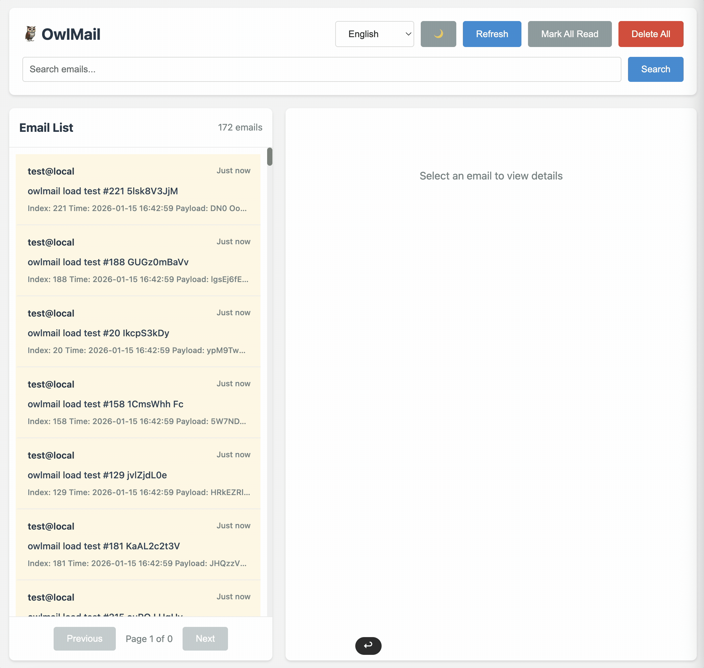

# OwlMail

> 🦉 Un server Go per lo sviluppo e il test delle email, con workflow in stile MailDev e API specifiche di OwlMail

[](https://go.dev/)
[](LICENSE)
[](./docs/it/OwlMail%20×%20MailDev%20-%20Full%20Feature%20&%20API%20Comparison%20and%20Migration%20White%20Paper.md)
[](.github/goreportcard-report.md)

## 🌍 Languages / 语言 / Sprachen / Langues / Lingue / 言語 / 언어

- [English](README.md) | [简体中文](README.zh-CN.md) | [Deutsch](README.de.md) | [Français](README.fr.md) | [Italiano](README.it.md) | [日本語](README.ja.md) | [한국어](README.ko.md)

---

OwlMail è un server SMTP con interfaccia web per ambienti di sviluppo e test.
Supporta workflow comuni di [MailDev](https://github.com/maildev/maildev), ma usa
risposte API e un protocollo WebSocket propri. Verifica le differenze documentate
prima di migrare client API o Socket.IO.


## 📸 Anteprima


## 🎥 Video dimostrativo



## ✨ Funzionalità

### Funzionalità Core

- ✅ **Server SMTP** - Riceve e memorizza tutte le email inviate (porta predefinita 1025)
- ✅ **Interfaccia Web** - Visualizza e gestisci le email tramite un browser (porta predefinita 1080)
- ✅ **Persistenza Email** - Le email vengono salvate come file `.eml`, supporta il caricamento da directory
- ✅ **Inoltro Email** - Supporta l'inoltro di email a server SMTP reali
- ✅ **Inoltro Automatico** - Supporta l'inoltro automatico di tutte le email con filtri basati su regole
- ✅ **Inoltro Webhook** - Invia le nuove email corrispondenti a webhook HTTP con modelli di messaggio personalizzati
- ⚠️ **Autenticazione SMTP in ingresso** - I parametri esistono, ma i mittenti non autenticati non vengono attualmente rifiutati
- ✅ **TLS/STARTTLS** - Supporta connessioni crittografate
- ✅ **SMTPS** - Supporta la connessione TLS diretta sulla porta 465 quando SMTP TLS è abilitato

### Funzionalità Avanzate

- 🆕 **Operazioni Batch** - Eliminazione batch, segnatura batch come lette
- 🆕 **Notifiche browser** - Notifiche live opzionali per le nuove email
- 🆕 **Statistiche Email** - Ottieni statistiche sulle email
- 🆕 **Anteprima Email** - API leggera per l'anteprima delle email
- 🆕 **Esportazione Email** - Esporta email come file ZIP
- 🆕 **API di Gestione Configurazione** - Gestione completa della configurazione (GET/PUT/PATCH)
- 🆕 **Ricerca Potente** - Ricerca full-text, filtri per intervallo di date, ordinamento
- 🆕 **API RESTful Migliorata** - Design API più standardizzato (`/api/v1/*`)
- 🆕 **Guida integrata** - Guida locale bilingue dalla casella di posta o su `/help`
- 🆕 **Configuratore Webhook** - Editor locale integrato in `/webhooks` per creare, importare, validare, copiare e scaricare le regole di inoltro

### Compatibilità

- ✅ **Route per workflow in stile MailDev** - Flussi comuni per email, relay, configurazione e health check
- ✅ **Alias selezionati per variabili MailDev** - I nomi `MAILDEV_*` supportati sono nella tabella di configurazione
- ✅ **Regole di inoltro automatico** - Regole JSON allow/deny in stile MailDev
- ⚠️ **Differenze documentate** - Prefissi API, payload, stato di lettura e protocollo live non sono identici

### Caratteristiche di distribuzione

- ⚡ **Binario singolo** - Interfaccia e guida sono incorporate
- ⚡ **Nessun runtime del linguaggio** - Il binario non richiede Go, Bun o Node.js
- ⚡ **Concorrenza esplicita** - I Webhook possono essere limitati o intenzionalmente illimitati

Il repository non pubblica benchmark comparativi riproducibili. Misura avvio,
memoria e throughput con il tuo carico reale.

## 🚀 Quick Start

### Installazione

#### Compilazione da Sorgente

```bash
# Clona il repository
git clone https://github.com/soulteary/owlmail.git
cd owlmail

# Compila
go build -o owlmail ./cmd/owlmail

# Esegui
./owlmail
```

#### Installa con Go

```bash
go install github.com/soulteary/owlmail/cmd/owlmail@latest
owlmail
```

### Utilizzo Base

```bash
# Avvia con configurazione predefinita (SMTP: 1025, Web: 1080)
./owlmail

# Porte personalizzate
./owlmail -smtp 1025 -web 1080

# Usa variabili d'ambiente
export MAILDEV_SMTP_PORT=1025
export MAILDEV_WEB_PORT=1080
./owlmail
```

### Utilizzo Docker

#### Scarica da GitHub Container Registry (Consigliato)

Il modo più semplice per usare OwlMail è scaricare l'immagine pre-costruita da GitHub Container Registry:

```bash
# Scarica la release 0.6.0
docker pull ghcr.io/soulteary/owlmail:0.6.0

# Scarica l'immagine di un commit esatto (esempio)
docker pull ghcr.io/soulteary/owlmail:sha-b130f33

# Esegui container
docker run -d \
  -p 1025:1025 \
  -p 1080:1080 \
  --name owlmail \
  ghcr.io/soulteary/owlmail:0.6.0
```

**Tag disponibili:**
- `0.6.0` - Tag di release esatto; `0.6` e `0` avanzano con le release successive della serie
- `sha-<commit>` - Immagine per uno SHA breve specifico (ad esempio `sha-b130f33`)
- `main` - Immagine mobile dell'ultimo build di `main`
- `latest` - Immagine mobile del branch predefinito, non un selettore di release stabile

**Supporto multi-architettura:**
L'immagine supporta sia le architetture `linux/amd64` che `linux/arm64`. Docker scaricherà automaticamente l'immagine corretta per la tua piattaforma.

**Visualizza tutte le immagini disponibili:** [GitHub Packages](https://github.com/users/soulteary/packages/container/package/owlmail)

#### Costruisci dal sorgente

##### Build Base (Architettura Singola)

```bash
# Crea immagine per l'architettura corrente
docker build -t owlmail .

# Esegui container
docker run -d \
  -p 1025:1025 \
  -p 1080:1080 \
  --name owlmail \
  owlmail
```

##### Build Multi-Architettura

Per aarch64 (ARM64) o altre architetture, usa Docker Buildx:

```bash
# Abilita buildx (se non già abilitato)
docker buildx create --use --name multiarch-builder

# Compila per più architetture
docker buildx build \
  --platform linux/amd64,linux/arm64 \
  -t owlmail:latest \
  --load .

# Oppure compila e invia al registry
docker buildx build \
  --platform linux/amd64,linux/arm64 \
  -t your-registry/owlmail:latest \
  --push .

# Compila per architettura specifica (es. aarch64/arm64)
docker buildx build \
  --platform linux/arm64 \
  -t owlmail:latest \
  --load .
```

**Nota**: Il Dockerfile ora supporta build multi-architettura usando gli argomenti di build `TARGETOS` e `TARGETARCH`, che vengono impostati automaticamente da Docker Buildx.

## 📖 Opzioni di Configurazione

### Argomenti da Riga di Comando

| Argomento | Variabile d'Ambiente | Predefinito | Descrizione |
|-----------|---------------------|-------------|-------------|
| `-smtp` | `MAILDEV_SMTP_PORT` / `OWLMAIL_SMTP_PORT` | 1025 | Porta SMTP |
| `-ip` | `MAILDEV_IP` / `OWLMAIL_SMTP_HOST` | localhost | Host SMTP |
| `-web` | `MAILDEV_WEB_PORT` / `OWLMAIL_WEB_PORT` | 1080 | Porta API Web |
| `-web-ip` | `MAILDEV_WEB_IP` / `OWLMAIL_WEB_HOST` | localhost | Host API Web |
| `-mail-directory` | `MAILDEV_MAIL_DIRECTORY` / `OWLMAIL_MAIL_DIR` | - | Directory di archiviazione email |
| `-mail-retention-days` | `OWLMAIL_MAIL_RETENTION_DAYS` | 0 | Mail retention days; `0` is unlimited |
| `-mail-max-messages` | `OWLMAIL_MAIL_MAX_MESSAGES` | 0 | Maximum stored messages; `0` is unlimited |
| `-mail-max-disk-mb` | `OWLMAIL_MAIL_MAX_DISK_MB` | 0 | Maximum mailbox MiB; `0` is unlimited |
| `-mail-cleanup-interval` | `OWLMAIL_MAIL_CLEANUP_INTERVAL` | 1h | Background cleanup interval |
| `-web-user` | `MAILDEV_WEB_USER` / `OWLMAIL_WEB_USER` | - | Nome utente HTTP Basic Auth |
| `-web-password` | `MAILDEV_WEB_PASS` / `OWLMAIL_WEB_PASSWORD` | - | Password HTTP Basic Auth |
| `-https` | `MAILDEV_HTTPS` / `OWLMAIL_HTTPS_ENABLED` | false | Abilita HTTPS |
| `-https-cert` | `MAILDEV_HTTPS_CERT` / `OWLMAIL_HTTPS_CERT` | - | File certificato HTTPS |
| `-https-key` | `MAILDEV_HTTPS_KEY` / `OWLMAIL_HTTPS_KEY` | - | File chiave privata HTTPS |
| `-outgoing-host` | `MAILDEV_OUTGOING_HOST` / `OWLMAIL_OUTGOING_HOST` | - | Host SMTP in uscita |
| `-outgoing-port` | `MAILDEV_OUTGOING_PORT` / `OWLMAIL_OUTGOING_PORT` | 587 | Porta SMTP in uscita |
| `-outgoing-user` | `MAILDEV_OUTGOING_USER` / `OWLMAIL_OUTGOING_USER` | - | Nome utente SMTP in uscita |
| `-outgoing-pass` | `MAILDEV_OUTGOING_PASS` / `OWLMAIL_OUTGOING_PASSWORD` | - | Password SMTP in uscita |
| `-outgoing-secure` | `MAILDEV_OUTGOING_SECURE` / `OWLMAIL_OUTGOING_SECURE` | false | TLS SMTP in uscita |
| `-auto-relay` | `MAILDEV_AUTO_RELAY` / `OWLMAIL_AUTO_RELAY` | false | Abilita inoltro automatico |
| `-auto-relay-addr` | `MAILDEV_AUTO_RELAY_ADDR` / `OWLMAIL_AUTO_RELAY_ADDR` | - | Indirizzo inoltro automatico |
| `-auto-relay-rules` | `MAILDEV_AUTO_RELAY_RULES` / `OWLMAIL_AUTO_RELAY_RULES` | - | File regole inoltro automatico |
| `-webhook-config` | `OWLMAIL_WEBHOOK_CONFIG` | - | File JSON di configurazione dell'inoltro webhook |
| `-webhook-max-concurrency` | `OWLMAIL_WEBHOOK_MAX_CONCURRENCY` | 8 | Consegne Webhook simultanee; `0` disabilita il limite |
| `-webhook-redis-url` | `OWLMAIL_WEBHOOK_REDIS_URL` | - | Redis URL for durable webhook delivery |
| `-webhook-redis-prefix` | `OWLMAIL_WEBHOOK_REDIS_PREFIX` | owlmail:webhooks | Redis Streams key prefix |
| `-webhook-shutdown-timeout` | `OWLMAIL_WEBHOOK_SHUTDOWN_TIMEOUT` | 15s | Graceful webhook drain deadline |
| `-smtp-user` | `MAILDEV_INCOMING_USER` / `OWLMAIL_SMTP_USER` | - | Nome utente SMTP in ingresso; attualmente non applicato |
| `-smtp-password` | `MAILDEV_INCOMING_PASS` / `OWLMAIL_SMTP_PASSWORD` | - | Password SMTP in ingresso; attualmente non applicata |
| `-tls` | `MAILDEV_INCOMING_SECURE` / `OWLMAIL_TLS_ENABLED` | false | Abilita TLS SMTP |
| `-tls-cert` | `MAILDEV_INCOMING_CERT` / `OWLMAIL_TLS_CERT` | - | File certificato TLS SMTP |
| `-tls-key` | `MAILDEV_INCOMING_KEY` / `OWLMAIL_TLS_KEY` | - | File chiave privata TLS SMTP |
| `-log-level` | `MAILDEV_VERBOSE` / `MAILDEV_SILENT` / `OWLMAIL_LOG_LEVEL` | normal | Livello di log |
| `-use-uuid-for-email-id` | `OWLMAIL_USE_UUID_FOR_EMAIL_ID` | false | Usa UUID per ID email (predefinito: stringa casuale di 8 caratteri) |

When TLS terminates at a reverse proxy, set `OWLMAIL_WEB_EXTERNAL_SCHEME` to `https`.

Una configurazione incompleta dell’autenticazione Web non viene disabilitata silenziosamente:

| Valori configurati | Credenziali effettive |
|---|---|
| Nessuno | Autenticazione disabilitata |
| Solo nome utente | Il nome utente e una password temporanea casuale crittograficamente sicura di 32 caratteri, stampata una volta su stderr all’avvio |
| Solo password | Nome utente `admin` e password configurata |
| Entrambi i valori | Nome utente e password configurati |

Una password generata cambia a ogni riavvio. Leggila dall’output del processo
(`docker logs owlmail` nell’esempio con container), oppure configura entrambi i
valori per ottenere credenziali stabili. OwlMail non si avvia se non può scrivere
la password generata su stderr. Usa Basic Auth solo tramite localhost o HTTPS.

### Compatibilità Variabili d'Ambiente

OwlMail supporta gli alias MailDev elencati nella tabella e li preferisce alle
corrispondenti variabili `OWLMAIL_*`. Le opzioni MailDev non elencate non sono
supportate automaticamente.

```bash
# Usa direttamente le variabili d'ambiente MailDev (consigliato)
export MAILDEV_SMTP_PORT=1025
export MAILDEV_WEB_PORT=1080
export MAILDEV_OUTGOING_HOST=smtp.gmail.com
./owlmail

# Oppure usa le variabili d'ambiente OwlMail
export OWLMAIL_SMTP_PORT=1025
export OWLMAIL_WEB_PORT=1080
./owlmail
```

## 📡 Documentazione API

### Formato Risposta API

OwlMail utilizza un formato di risposta API standardizzato:

**Risposta di Successo:**
```json
{
  "code": "EMAIL_DELETED",
  "message": "Email deleted",
  "data": { ... }
}
```

**Risposta di Errore:**
```json
{
  "code": "EMAIL_NOT_FOUND",
  "error": "EMAIL_NOT_FOUND",
  "message": "Email not found"
}
```

Il campo `code` contiene codici di errore/successo standardizzati che possono essere utilizzati per l'internazionalizzazione. Il campo `message` fornisce testo in inglese per la compatibilità con le versioni precedenti.

### Formato ID Email

OwlMail supporta due formati di ID email e tutti gli endpoint API sono compatibili con entrambi:

- **Stringa casuale di 8 caratteri**: Formato predefinito, es. `aB3dEfGh`
- **Formato UUID**: UUID standard di 36 caratteri, es. `550e8400-e29b-41d4-a716-446655440000`

Quando usi il parametro `:id` nelle richieste API, puoi usare entrambi i formati. Ad esempio:
- `GET /email/aB3dEfGh` - Usando ID stringa casuale
- `GET /email/550e8400-e29b-41d4-a716-446655440000` - Usando ID UUID

### Route di compatibilità in stile MailDev

OwlMail mantiene route senza versione per i workflow comuni, ma non sono
equivalenti esatti dell'API MailDev corrente. Consulta il
[riferimento API](./docs/en/API-Reference.md#maildev-migration-boundary).

#### Operazioni Email

- `GET /email` - Ottieni tutte le email (supporta paginazione e filtri)
  - Parametri di query:
    - `limit` (predefinito: 50, max: 1000) - Numero di email da restituire
    - `offset` (predefinito: 0) - Numero di email da saltare
    - `q` - Query di ricerca full-text
    - `from` - Filtra per indirizzo email mittente
    - `to` - Filtra per indirizzo email destinatario
    - `dateFrom` - Filtra per data da (formato YYYY-MM-DD)
    - `dateTo` - Filtra per data fino a (formato YYYY-MM-DD)
    - `read` - Filtra per stato di lettura (true/false)
    - `sortBy` - Ordina per campo (time, subject, from, size)
    - `sortOrder` - Ordine di ordinamento (asc, desc, predefinito: desc)
  - Esempio: `GET /email?limit=20&offset=0&q=test&sortBy=time&sortOrder=desc`
- `GET /email/:id` - Ottieni singola email
- `DELETE /email/:id` - Elimina singola email
- `DELETE /email/all` - Elimina tutte le email
- `PATCH /email/read-all` - Segna tutte le email come lette
- `PATCH /email/:id/read` - Segna singola email come letta

#### Contenuto Email

- `GET /email/:id/html` - Ottieni contenuto HTML email
- `GET /email/:id/attachment/:filename` - Scarica allegato
- `GET /email/:id/download` - Scarica file .eml grezzo
- `GET /email/:id/source` - Ottieni sorgente grezza email

#### Inoltro Email

- `POST /email/:id/relay` - Inoltra email al server SMTP configurato
- `POST /email/:id/relay/:relayTo` - Inoltra email a indirizzo specifico

#### Configurazione e Sistema

- `GET /config` - Ottieni informazioni di configurazione
- `GET /healthz` - Controllo salute
- `GET /reloadMailsFromDirectory` - Ricarica email da directory
- `GET /socket.io` - Connessione WebSocket (WebSocket standard, non Socket.IO)

### API Avanzata OwlMail

#### Statistiche e Anteprima Email

- `GET /email/stats` - Ottieni statistiche email
- `GET /email/preview` - Ottieni anteprima email (leggera)

#### Operazioni Batch

- `POST /email/batch/delete` - Elimina email in batch
- `POST /email/batch/read` - Segna come lette in batch

#### Esportazione Email

- `GET /email/export` - Esporta email come file ZIP

#### Gestione Configurazione

- `GET /config/outgoing` - Ottieni configurazione in uscita
- `PUT /config/outgoing` - Aggiorna configurazione in uscita
- `PATCH /config/outgoing` - Aggiorna parzialmente configurazione in uscita

### API RESTful Migliorata (`/api/v1/*`)

OwlMail fornisce un design API RESTful più standardizzato:

- `GET /api/v1/emails` - Ottieni tutte le email (risorsa plurale)
  - Parametri di query: Stessi di `GET /email` (limit, offset, q, from, to, dateFrom, dateTo, read, sortBy, sortOrder)
  - Esempio: `GET /api/v1/emails?limit=20&offset=0&q=test&sortBy=time&sortOrder=desc`
- `GET /api/v1/emails/:id` - Ottieni singola email
- `DELETE /api/v1/emails/:id` - Elimina singola email
- `DELETE /api/v1/emails` - Elimina tutte le email
- `DELETE /api/v1/emails/batch` - Eliminazione batch
- `PATCH /api/v1/emails/read` - Segna tutte le email come lette
- `PATCH /api/v1/emails/:id/read` - Segna singola email come letta
- `PATCH /api/v1/emails/batch/read` - Segna come lette in batch
- `GET /api/v1/emails/stats` - Statistiche email
- `GET /api/v1/emails/preview` - Anteprima email
- `GET /api/v1/emails/export` - Esporta email
- `POST /api/v1/emails/reload` - Ricarica email
- `GET /api/v1/settings` - Ottieni tutte le impostazioni
- `GET /api/v1/settings/outgoing` - Ottieni configurazione in uscita
- `PUT /api/v1/settings/outgoing` - Aggiorna configurazione in uscita
- `PATCH /api/v1/settings/outgoing` - Aggiorna parzialmente configurazione in uscita
- `GET /api/v1/health` - Controllo salute
- `GET /api/v1/ws` - Connessione WebSocket

Il contratto corrente, incluse sottorisorse, autenticazione, risposte ed eventi
WebSocket, è nel [riferimento API](./docs/en/API-Reference.md).

## 🔧 Esempi di Utilizzo

### Utilizzo Base

```bash
# Avvia OwlMail
./owlmail -smtp 1025 -web 1080

# Configura SMTP nella tua applicazione
SMTP_HOST=localhost
SMTP_PORT=1025
```

### Configura Inoltro Email

```bash
# Inoltra a SMTP Gmail
./owlmail \
  -outgoing-host smtp.gmail.com \
  -outgoing-port 587 \
  -outgoing-user your-email@gmail.com \
  -outgoing-pass your-password \
  -outgoing-secure
```

### Modalità Inoltro Automatico

```bash
# Crea file regole inoltro automatico (relay-rules.json)
cat > relay-rules.json <<EOF
[
  { "allow": "*" },
  { "deny": "*@test.com" },
  { "allow": "ok@test.com" }
]
EOF

# Avvia inoltro automatico
./owlmail \
  -outgoing-host smtp.gmail.com \
  -outgoing-port 587 \
  -outgoing-user your-email@gmail.com \
  -outgoing-pass your-password \
  -auto-relay \
  -auto-relay-rules relay-rules.json
```

### Usa HTTPS

```bash
./owlmail \
  -https \
  -https-cert /path/to/cert.pem \
  -https-key /path/to/key.pem \
  -web 1080
```

### Limite dell’autenticazione SMTP in ingresso

> [!WARNING]
> `-smtp-user` e `-smtp-password` compilano attualmente la configurazione, ma
> la sessione SMTP non rifiuta i mittenti non autenticati. Isola il listener
> SMTP tramite binding dell’interfaccia, firewall o tunnel privato.

### Usa TLS

```bash
./owlmail \
  -tls \
  -tls-cert /path/to/cert.pem \
  -tls-key /path/to/key.pem \
  -smtp 1025
```

**Nota**: Quando TLS è abilitato, OwlMail avvia automaticamente un server SMTPS sulla porta 465 oltre al server SMTP regolare. Il server SMTPS utilizza una connessione TLS diretta (non è richiesto STARTTLS).

### Usa UUID per ID Email

OwlMail supporta due formati di ID email:

1. **Formato predefinito**: Stringa casuale di 8 caratteri (es. `aB3dEfGh`)
2. **Formato UUID**: UUID standard di 36 caratteri (es. `550e8400-e29b-41d4-a716-446655440000`)

L'uso del formato UUID fornisce migliore unicità e tracciabilità, particolarmente utile per l'integrazione con sistemi esterni.

```bash
# Abilita UUID usando flag da riga di comando
./owlmail -use-uuid-for-email-id

# Abilita UUID usando variabile d'ambiente
export OWLMAIL_USE_UUID_FOR_EMAIL_ID=true
./owlmail

# Usa con altre configurazioni
./owlmail \
  -use-uuid-for-email-id \
  -smtp 1025 \
  -web 1080
```

**Note**:
- Il predefinito usa stringa casuale di 8 caratteri, compatibile con il comportamento MailDev
- Quando UUID è abilitato, tutte le email appena ricevute useranno ID in formato UUID
- L'API supporta entrambi i formati ID, permettendo normale query, eliminazione e operazione delle email
- I formati ID email esistenti non cambieranno; solo le nuove email useranno il nuovo formato ID

## 🔄 Migrazione da MailDev

OwlMail copre workflow comuni di MailDev, ma i client correnti possono richiedere
adattamenti espliciti. Segui la
[guida alla migrazione](./docs/it/OwlMail%20×%20MailDev%20-%20Full%20Feature%20&%20API%20Comparison%20and%20Migration%20White%20Paper.md).

### 1. Compatibilità Variabili d'Ambiente

OwlMail accetta le variabili MailDev elencate nella tabella di configurazione.
Verifica tutte quelle usate nella distribuzione:

```bash
# Configurazione MailDev
export MAILDEV_SMTP_PORT=1025
export MAILDEV_WEB_PORT=1080
export MAILDEV_OUTGOING_HOST=smtp.gmail.com

# OwlMail può leggere queste variabili elencate
./owlmail
```

### 2. Compatibilità API

I percorsi e i payload API sono diversi. Usa l'API OwlMail versionata per le
nuove integrazioni e adatta esplicitamente i client esistenti:

```bash
# API MailDev corrente
curl http://localhost:1080/api/email

# API OwlMail
curl http://localhost:1080/api/v1/emails
```

### 3. Adattamento WebSocket

Se usi WebSocket, devi cambiare da Socket.IO a WebSocket standard:

```javascript
// MailDev (Socket.IO)
const socket = io('/socket.io');
socket.on('newMail', (email) => { /* ... */ });

// OwlMail (WebSocket Standard)
const ws = new WebSocket('ws://localhost:1080/socket.io');
ws.onmessage = (event) => {
  const data = JSON.parse(event.data);
  if (data.type === 'new') { /* ... */ }
};
```

Per guida di migrazione dettagliata, vedi: [OwlMail × MailDev: Confronto Completo Funzionalità e API e White Paper di Migrazione](./docs/it/OwlMail%20×%20MailDev%20-%20Full%20Feature%20&%20API%20Comparison%20and%20Migration%20White%20Paper.md)

## 🧪 Test

```bash
# Esegui tutti i test
go test ./...

# Esegui test con copertura
go test -cover ./...

# Esegui test per pacchetti specifici
go test ./internal/api/...
go test ./internal/mailserver/...
```

## 📦 Struttura Progetto

```
OwlMail/
├── cmd/
│   └── owlmail/          # Punto di ingresso programma principale
├── internal/
│   ├── api/              # Implementazione API Web
│   ├── common/           # Utility comuni (logging, gestione errori)
│   ├── maildev/          # Livello compatibilità MailDev
│   ├── mailserver/       # Implementazione server SMTP
│   ├── outgoing/         # Implementazione inoltro email
│   ├── types/            # Definizioni di tipo
│   └── webhook/          # Filtri, modelli, firme e consegna Webhook
├── docs/                 # Documentazione API, operativa, Webhook e migrazione
├── examples/             # Esempi di integrazione eseguibili
├── tests/                # Test del browser e del contratto documentale
├── web/                  # File frontend web
├── go.mod                # Definizione modulo Go
└── README.md             # Questo documento
```

## 🤝 Contribuire

I contributi sono benvenuti! Segui questi passaggi:

1. Fai un fork del repository
2. Crea un branch per la funzionalità (`git checkout -b feature/AmazingFeature`)
3. Committa le tue modifiche (`git commit -m 'Add some AmazingFeature'`)
4. Invia al branch (`git push origin feature/AmazingFeature`)
5. Apri una Pull Request

## 📄 Licenza

Questo progetto è concesso in licenza sotto la Licenza MIT - vedi il file [LICENSE](LICENSE) per i dettagli.

## 🙏 Ringraziamenti

- [MailDev](https://github.com/maildev/maildev) - Ispirazione progetto originale
- [emersion/go-smtp](https://github.com/emersion/go-smtp) - Libreria server SMTP
- [emersion/go-message](https://github.com/emersion/go-message) - Libreria parsing email
- [Fiber](https://github.com/gofiber/fiber) - Framework web
- [gorilla/websocket](https://github.com/gorilla/websocket) - Libreria WebSocket

## 📚 Documentazione Correlata

- [Note di rilascio OwlMail 0.6.0](./docs/en/Release-0.6.0.md) ([中文](./docs/zh-CN/Release-0.6.0.md))
- [Registro delle modifiche](./CHANGELOG.md)
- [OwlMail × MailDev: Confronto Completo Funzionalità e API e White Paper di Migrazione](./docs/it/OwlMail%20×%20MailDev%20-%20Full%20Feature%20&%20API%20Comparison%20and%20Migration%20White%20Paper.md)
- [Riferimento API (English)](./docs/en/API-Reference.md)
- [Operazioni e risoluzione problemi (English)](./docs/en/Operations.md)
- [Inoltro Webhook (English)](./docs/en/Webhook-Forwarding.md)
- [Processo di rilascio (English)](./docs/en/Releasing.md)
- [Registro Refactoring API (storico)](./docs/it/internal/API_Refactoring_Record.md)

## 🐛 Segnalazione Problemi

Se riscontri problemi o hai suggerimenti, inviali in [GitHub Issues](https://github.com/soulteary/owlmail/issues).

## ⭐ Storia Star

Se questo progetto ti aiuta, per favore dagli una Star ⭐!

---

**OwlMail** - Un server Go per test email con percorsi di migrazione MailDev documentati 🦉
