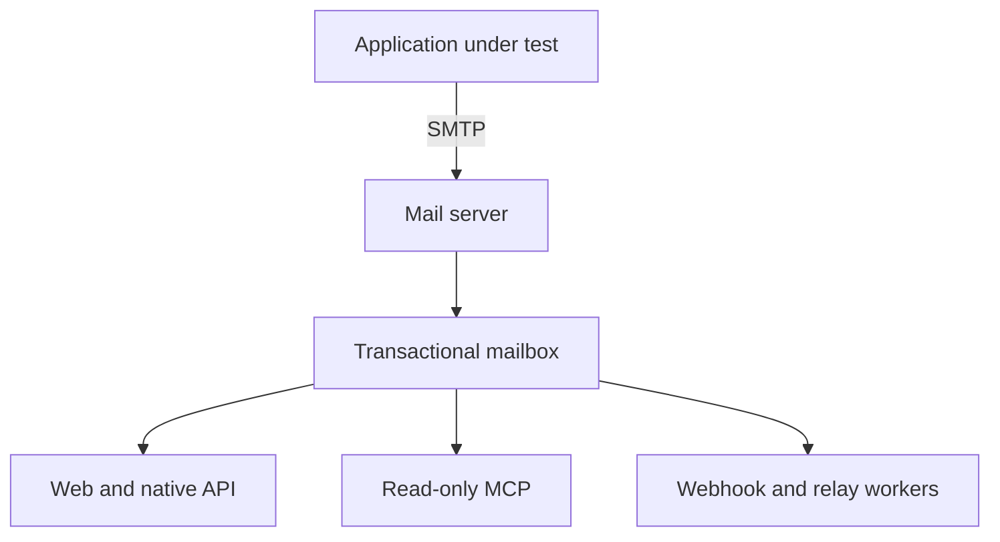

# Architecture

OwlMail is one Go executable with embedded Web assets. It captures SMTP mail,
commits it to a mailbox, and exposes independent inspection and automation
surfaces around that committed state.

## Component map

| Package | Responsibility |
|---|---|
| `cmd/owlmail` | CLI parsing, startup wiring, subcommands, and ordered shutdown |
| `internal/config` | Defaults, layered YAML/JSON, environment aliases, flags, and validation helpers |
| `internal/mailserver` | SMTP sessions, MIME parsing, transactional storage, queries, retention, and optional SQLite index |
| `internal/attachmentstore` | Local and optional S3-compatible attachment storage and readiness |
| `internal/api` | Web UI, native and compatibility HTTP routes, WebSocket, metrics, and relay jobs |
| `internal/mcpserver` | Bounded read-only MCP tools, resources, prompts, HTTP sessions, and stdio transport |
| `internal/webhook` | Filtered delivery, local outbox, optional Redis Streams, retry, and drain |
| `internal/outgoing` | Streaming outbound SMTP transport and TLS policy |
| `internal/sendmail` | Sendmail-compatible SMTP client subcommand |
| `internal/types` | Shared email data types |

These are internal packages, not a supported public Go embedding API.

## Inbound commit path

SMTP DATA capacity is acquired before message-body work. Raw EML and decoded
attachments are staged, hashed, synced, and atomically committed before the
message becomes visible. A failed parse, local write, S3 upload, or commit
rejects the SMTP transaction and rolls back staged artifacts.

Committed EML files and sidecars are authoritative. The in-memory store serves
thread-safe detached snapshots. The optional SQLite index accelerates mailbox
queries but can be rebuilt from stored mail; it is not a shared multi-instance
database.

## Downstream paths

- The Web UI, REST API, WebSocket, and MCP read the same mailbox boundary.
- Webhook acceptance is first recorded in the local outbox. Redis Streams can
  provide restart-safe queued delivery after handoff.
- Native v1 Relay accepts persistent asynchronous jobs when a mail directory
  is configured. Historical and compatibility routes do not acquire that job
  contract.
- MCP subscribes to committed `new` events for bounded waits; it never polls in
  HTTP mode and never owns a second mailbox index.

## Process and scaling boundary

Mailbox memory state, SQLite, local webhook outbox, and Relay job status belong
to one OwlMail instance. Do not point multiple writable instances at the same
mail directory. SMTP concurrency, MCP waiters, webhook concurrency, retention,
and job capacity are process-local limits, not distributed quotas.

## Lifecycle

Startup resolves configuration and storage before serving. Liveness reports
the process; readiness includes enabled dependency probes. Shutdown stops SMTP
intake and new downstream work, then applies bounded drain deadlines. Webhook
and Relay recovery are at least once, so receivers must be idempotent.

See [Operations](./Operations.md) for deployment details and
[Security model](./Security-Model.md) for trust boundaries.
