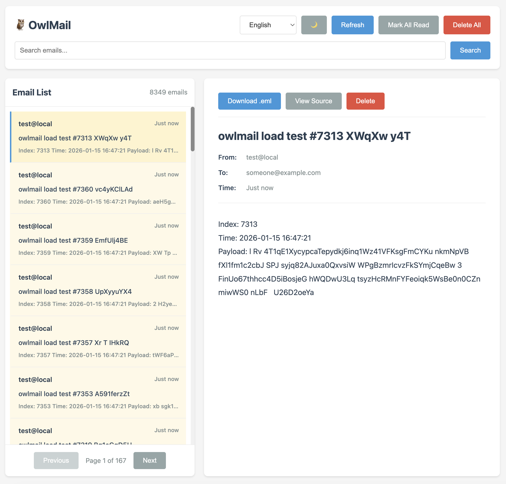

# OwlMail Documentation

Welcome to the OwlMail documentation directory. This directory contains technical documentation, migration guides, and API reference materials.

## 📸 Preview

## 🎥 Demo Video

<video width="100%" controls>
  <source src="../../.github/assets/realtime.mp4" type="video/mp4">
  Your browser does not support the video tag.
</video>

## 🌍 Languages / 语言 / Sprachen / Langues / Lingue / 言語 / 언어

- [English](../README.md#english) | [简体中文](../README.md#简体中文) | [Deutsch](../README.md#deutsch) | [Français](../README.md#français) | [Italiano](../README.md#italiano) | [日本語](../README.md#日本語) | [한국어](../README.md#한국어)

---

## 📚 Documentation Structure

### Main Documents

- **[OwlMail × MailDev - Full Feature & API Comparison and Migration White Paper](./OwlMail%20×%20MailDev%20-%20Full%20Feature%20&%20API%20Comparison%20and%20Migration%20White%20Paper.md)**
  - A comprehensive comparison between OwlMail and MailDev, including API compatibility, feature parity, and migration guide.
  - **Other languages**: [简体中文](../zh-CN/OwlMail%20×%20MailDev%20-%20Full%20Feature%20&%20API%20Comparison%20and%20Migration%20White%20Paper.md) | [Deutsch](../de/OwlMail%20×%20MailDev%20-%20Full%20Feature%20&%20API%20Comparison%20and%20Migration%20White%20Paper.md) | [Français](../fr/OwlMail%20×%20MailDev%20-%20Full%20Feature%20&%20API%20Comparison%20and%20Migration%20White%20Paper.md) | [Italiano](../it/OwlMail%20×%20MailDev%20-%20Full%20Feature%20&%20API%20Comparison%20and%20Migration%20White%20Paper.md) | [日本語](../ja/OwlMail%20×%20MailDev%20-%20Full%20Feature%20&%20API%20Comparison%20and%20Migration%20White%20Paper.md) | [한국어](../ko/OwlMail%20×%20MailDev%20-%20Full%20Feature%20&%20API%20Comparison%20and%20Migration%20White%20Paper.md)

### Internal Documentation

- **[API Refactoring Record](./internal/API_Refactoring_Record.md)**
  - Documents the API refactoring process from MailDev-compatible endpoints to the new RESTful API design (`/api/v1/`).
  - **Other languages**: [简体中文](../zh-CN/internal/API_Refactoring_Record.md) | [Deutsch](../de/internal/API_Refactoring_Record.md) | [Français](../fr/internal/API_Refactoring_Record.md) | [Italiano](../it/internal/API_Refactoring_Record.md) | [日本語](../ja/internal/API_Refactoring_Record.md) | [한국어](../ko/internal/API_Refactoring_Record.md)

## 📖 How to Read Documentation

Documents are organized by language in separate directories. Each language directory contains:
- `README.md` - Documentation index for that language
- Main documents (e.g., Migration White Paper)
- `internal/` subdirectory - Internal documentation

To switch languages, use the language selector at the top of this page or visit the [main documentation index](../README.md).

## 🔄 Contributing

When adding new documentation:

1. Create the English version first in the `en/` directory.
2. Add translations in the corresponding language directories.
3. Update all language README files to include links to new documents.
4. Follow the existing directory structure (documents in language directories, no language suffix in filenames).

## 📝 Document Categories

- **Migration Guides**: Help users migrate from MailDev to OwlMail
- **API Documentation**: Technical API reference and refactoring records
- **Internal Documentation**: Development notes and internal processes

---

For more information about OwlMail, please visit the [main README](../../README.md).
