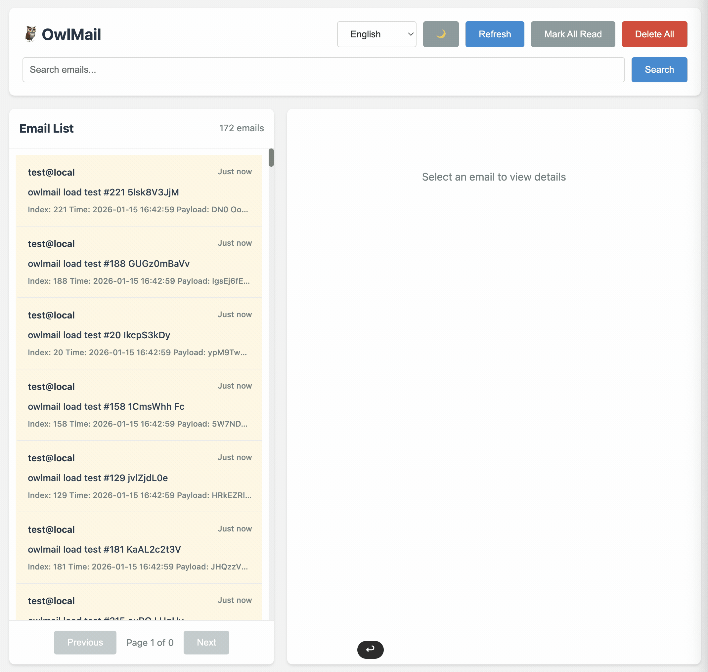

# OwlMail ドキュメント

OwlMail ドキュメントディレクトリへようこそ。このディレクトリには、技術ドキュメント、移行ガイド、API リファレンス資料が含まれています。

## 📸 プレビュー

## 🎥 デモ動画

## 📚 ドキュメント構造

### メインドキュメント

- **[OwlMail × MailDev - 機能と API の完全比較および移行ホワイトペーパー](./OwlMail%20×%20MailDev%20-%20Full%20Feature%20&%20API%20Comparison%20and%20Migration%20White%20Paper.md)** (英語)
  - [中文版本](./OwlMail%20×%20MailDev%20-%20Full%20Feature%20&%20API%20Comparison%20and%20Migration%20White%20Paper.zh-CN.md)
  - OwlMail と MailDev の包括的な比較。API 互換性、機能パリティ、移行ガイドを含みます。

### 内部ドキュメント

- **[API リファクタリング記録](./internal/API_Refactoring_Record.md)** (英語)
  - [中文版本](./internal/API_Refactoring_Record.zh-CN.md)
  - MailDev 互換エンドポイントから新しい RESTful API 設計 (`/api/v1/`) への API リファクタリングプロセスを文書化しています。

## 🌍 多言語サポート

すべてのドキュメントは、命名規則に従います：`filename.md`（英語、デフォルト）および他の言語の `filename.LANG.md`。

### サポートされている言語

- **English** (`en`) - デフォルト、言語コードサフィックスなし
- **简体中文** (`zh-CN`) - 中国語（簡体字）
- **日本語** (`ja`) - 日本語

### 言語コード形式

言語コードは [ISO 639-1](https://en.wikipedia.org/wiki/ISO_639-1) 標準に従います：
- `zh-CN` - 中国語（簡体字）
- `de` - ドイツ語（将来）
- `fr` - フランス語（将来）
- `it` - イタリア語（将来）
- `ja` - 日本語
- `ko` - 韓国語（将来）

## 📖 ドキュメントの読み方

1. **デフォルト言語**: 言語コードサフィックスのないドキュメントは英語（デフォルト）です。
2. **他の言語**: 言語コードサフィックス付きのドキュメント（例：`.zh-CN.md`）は翻訳版です。
3. **ディレクトリ構造**: ドキュメントはトピック別に整理され、内部ドキュメントは `internal/` サブディレクトリにあります。

## 🔄 貢献

新しいドキュメントを追加する場合：

1. まず英語版を作成します（デフォルト、言語コードなし）。
2. 適切な言語コードサフィックスで翻訳を追加します。
3. この README を更新して、新しいドキュメントへのリンクを含めます。
4. 既存の命名規則に従います。

## 📝 ドキュメントカテゴリ

- **移行ガイド**: ユーザーが MailDev から OwlMail に移行するのを支援
- **API ドキュメント**: 技術 API リファレンスとリファクタリング記録
- **内部ドキュメント**: 開発ノートと内部プロセス

---

OwlMail の詳細については、[メイン README](../README.ja.md) をご覧ください。
