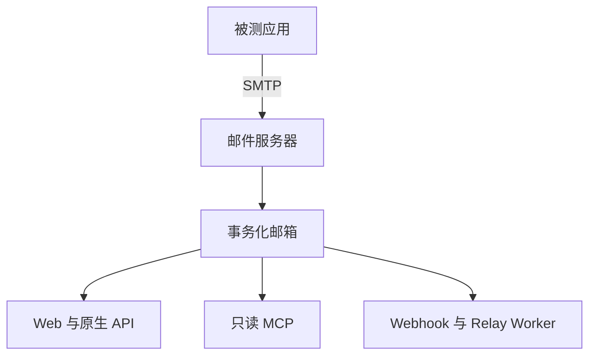

# 架构

OwlMail 是一个内嵌 Web 资源的 Go 可执行文件。它捕获 SMTP 邮件，原子提交到邮箱，
再围绕已提交状态提供相互独立的检查与自动化接口。

## 组件映射

| 包 | 职责 |
|---|---|
| `cmd/owlmail` | CLI、启动编排、子命令与有序关闭 |
| `internal/config` | 默认值、分层 YAML/JSON、环境变量别名、Flags 与校验辅助 |
| `internal/mailserver` | SMTP、MIME 解析、事务存储、查询、保留策略与可选 SQLite 索引 |
| `internal/attachmentstore` | 本地及可选 S3 兼容附件存储与就绪探测 |
| `internal/api` | Web UI、原生/兼容 HTTP、WebSocket、指标与 Relay Job |
| `internal/mcpserver` | 有界只读工具、资源、Prompt、HTTP 会话与 stdio Transport |
| `internal/webhook` | 过滤投递、本地 outbox、可选 Redis Streams、重试与排空 |
| `internal/outgoing` | 流式出站 SMTP 与 TLS 策略 |
| `internal/sendmail` | Sendmail 兼容 SMTP 客户端子命令 |
| `internal/types` | 共享邮件数据类型 |

这些是内部包，不是受支持的公共 Go 嵌入 API。

## 入站提交路径

处理正文前先取得 SMTP DATA 容量。原始 EML 与解码附件经过暂存、摘要、同步与原子
提交后才对外可见。解析、本地写入、S3 上传或提交失败会拒绝 SMTP 事务并回滚暂存物。

已提交 EML 与 sidecar 是事实来源。内存 Store 提供线程安全的独立快照。可选 SQLite
索引用于加速查询，可从已存邮件重建；它不是共享的多实例数据库。

## 下游路径

- Web UI、REST API、WebSocket 与 MCP 读取同一个邮箱边界。
- Webhook 接受先写入本地 outbox；Redis Streams 可让 handoff 后的排队投递跨重启恢复。
- 配置邮件目录后，原生 v1 Relay 接受持久异步 Job；历史与兼容路由不具备该 Job 契约。
- MCP 为有界等待订阅已提交 `new` 事件；HTTP 模式不轮询，也不维护第二份邮箱索引。

## 进程与扩展边界

邮箱内存状态、SQLite、本地 Webhook outbox 与 Relay Job 状态属于单个实例。不要让
多个可写实例指向同一邮件目录。SMTP 并发、MCP Waiter、Webhook 并发、保留策略和
Job 容量都是进程级限制，不是分布式配额。

## 生命周期

启动时先解析配置和存储，再开始服务。Liveness 表示进程存活；Readiness 包含已启用
依赖的探测。关闭先停止 SMTP 入口和新下游工作，再按有界截止时间排空。Webhook 与
Relay 恢复均为至少一次，下游必须保持幂等。

部署细节见[运维与排障](./Operations.md)，信任边界见[安全模型](./Security-Model.md)。
